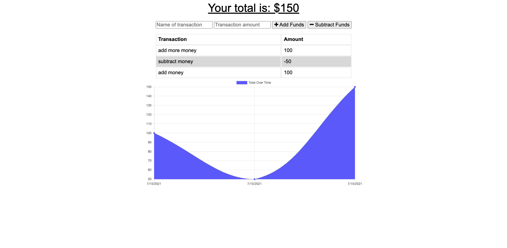

# PWA_Budget_Tracker

 
 

## **Description**
* Allows users to add an subtract from their budget. No matter if they are on or offline. 
 
 

## **Table of Contents**
- [Installation](#Installation)  
- [Usage](#Usage)  
- [License](#License)  
- [Contributing](#Contributing)  
- [Tests](#Tests)  
- [Questions](#Questions)  
 
 

## **Installation**
* Use Heroku.
 
 

## **Usage**
* Enables you to keep track of your budget even if you lose connection to the internet.
 
 

## **License**
### *MIT*  
        A short and simple permissive license with conditions only requiring preservation of copyright and license notices. Licensed works, modifications, and larger works may be distributed under different terms and without source code.
 

## **Contributing**
* No contributions at this time.
 
 

## **Tests**
    
* npm run start 
 
 

## **Questions**
* GitHub: https://github.com/KevinHenleyCode

* For more questions you can reach me at my Email:(kevinhenleyinfo@gmail.com)

 
 

## **Screenshot**

 
 

## **Links**
[Site](https://nameless-waters-70441.herokuapp.com/)
